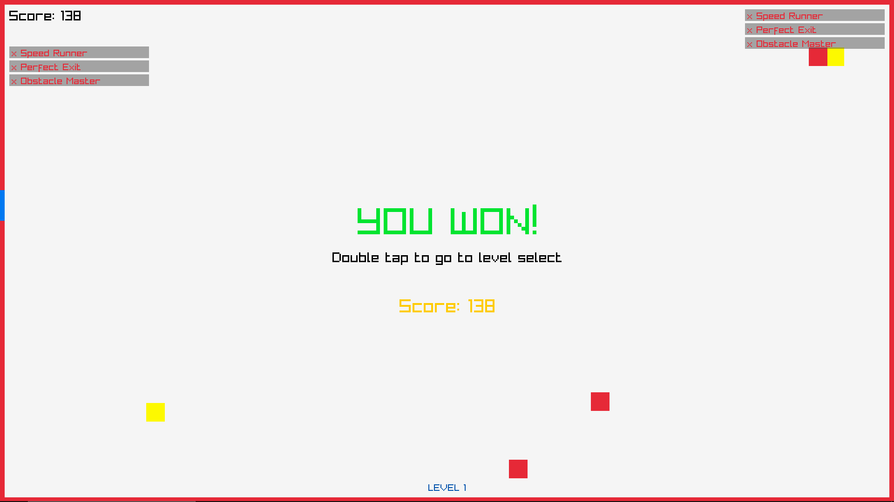
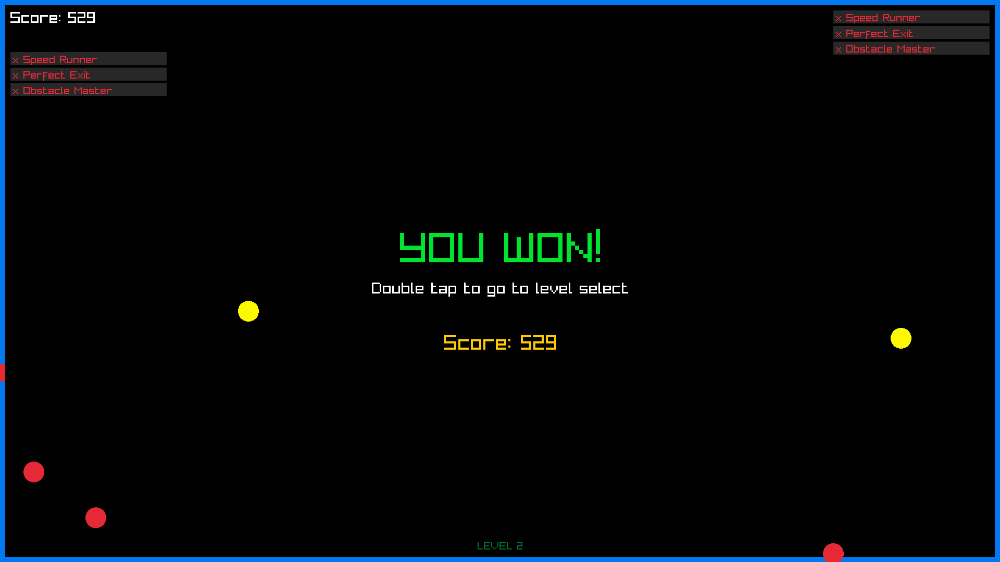

# Border Break Game

Help our little ball escape the fiery room and reach the cold freedom outside!

## Screenshots

.png>)

## Platforms

- Desktop
- Mobile (Raymob, Android Studio)

## About

Border Break is a simple yet engaging game developed using C++ and the Raylib library. Your goal is to guide the ball to freedom using intuitive swipe gestures.

## Features

- **Physics-Based Gameplay:** Experience realistic ball physics with wall collisions, swipe-based pushing, and friction.
- **The Hole:** The escape hole is slightly larger than the ball (110% of its size) for a fair challenge.
- **Sound Effects:** Enjoy immersive sound effects for bouncing and winning.
- **Theme and Visuals:** Features a theme song, splash screen with the ball and fire, and a background image/pattern.
- **Score System:** Your score is calculated based on time and the number of touches. Aim for the shortest time and fewest touches for the highest score!
- **Multiple Levels:** Includes 2 different levels to test your skills.
- **Random Hole Placement:** The hole's location changes each time you play.
- **Sound Effects:** Collision and passing sound effects.
- **Visual Effects:** Ball appearance and lighting effects.
- **Ball Size:** Ball diameter changes based on level complexity.
- **Obstacles:** Two types of obstacles: deadly (red) that reset player position and bouncy (yellow) that provide extra bounce force.
- **Achievement System:** Three achievements to unlock:
  - Speed Runner: Complete level in under 10 seconds
  - Perfect Exit: Exit through hole with score above 5000
  - Obstacle Master: Complete level without hitting deadly obstacles
- Multiple Ball Skins with Special Effects

## Technologies Used

- C++
- Raylib

## Future Enhancements

- Fine-tune hole tolerance.
- Explore how device orientation can influence the game.
