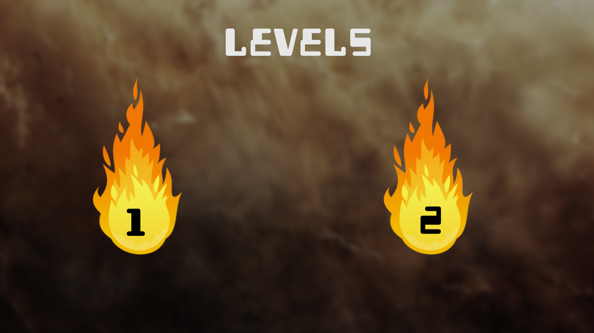

# Border Break  Game

a game made using C++ and Raylib library

our ball is trying to escape from the fire room through the hole to the cold outside where he belongs help him escape
it contains 

collision with the walls
swipe gesture to push the ball
friction

the hole is 110% of the ball size

sound effect for bouncing and winngin

theme song and splash start  screen  ball behind him fire

background image or pattern

score the calculated based on time and number oftouches the user performed,
<!-- score based on number of collisions : score start from 100 and decrease with the no. of bounces -->shortest time and lowest touch
counts gives higher score.

2 different levels  ❌

the hole  placment is random each time.

Sound effects related to ball collision and passing
through.❌
 Visual effects related to ball appearance and lighting❌
effect

fix hole big tolerance 

One ball diameters according to complexity level

Physical positioning of mobile affects the game
appearance
